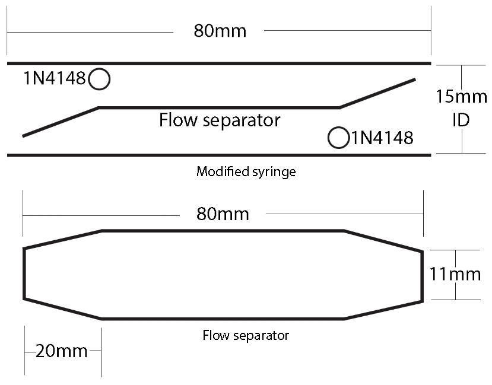
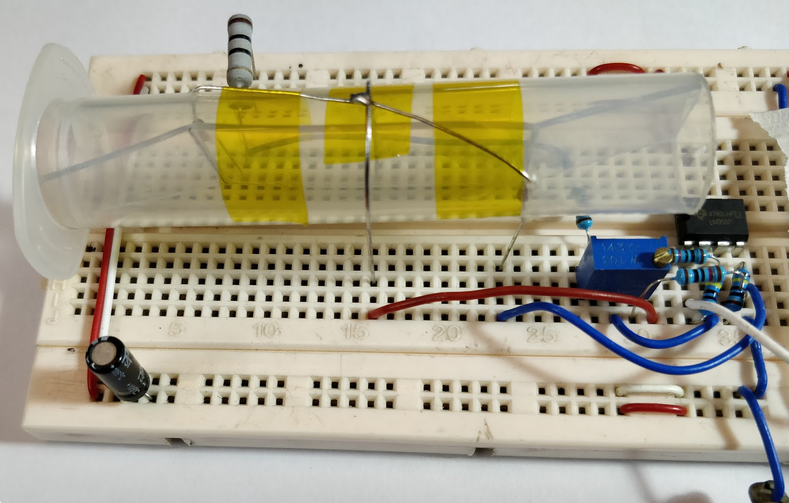

[Demo Video](https://www.youtube.com/watch?v=aSJlc7u3Vi4)

Due to the COVID-19 pandemic, people all over the world are trying to make ventilators. In emergencies like this, finding an air flow sensor for your ventilator system can be challenging. This sensor can at least detect the presence of air flow and its direction and combined with a bit of DSP and proper calibration, linear air flow sensing can be achieved. I hope this will help someone somewhere make a system that will save lives.

**Working Principle:**

Without going into much details, this circuit works by heating both 1N4148 Diodes with forward biasing. When the air blows across the diodes, differential voltages are generated due to complex semiconductor magic. The LM358 circuit amplifies the small voltage to a level where it can be used by your arduino or DSP circuit to determine air flow.

**Sensor Tube:**

The sensor tube is made out of a 10cc syringe. The diodes are placed on both sides of the tube and a flow separator is used to get differential reading due to direction of flow.

Modified syringe:

Flow separator:

**Dimensions:**

**Prototype Circuit:**

**Note:**

*   If you make this circuit on a breadboard, take care of parasitic capacitance, contact resistance and ground loops.
*   Both diodes (1N4148) and 10R 2W resistor will heat up. This is normal.
*   External Temperature Compensation may be needed.
*   Depending on the ambient temperature, about 10 seconds of Warm up time needed.
*   Noise shielding is necessary on the final circuit.

**Use it at your own risk. Good Luck.**
